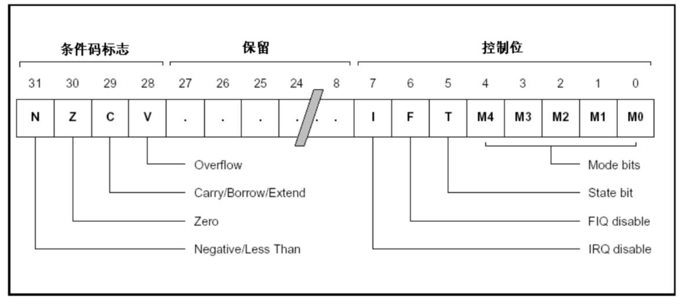

## arm64汇编相关知识

#### 1、寄存器

>通用寄存器
>
>x0--x30都是64位的通用整形寄存器，w0--w30是它们的低32位寄存器。其中x0—x7常用来存放函数参数，更多的参数由堆栈传递，x0一般用做函数返回值，当返回值超过8个字节会保存在x0和x1中，浮点型的返回值会被保存在v0到v3这几个向量寄存器中。

>向量（浮点型）寄存器
>
>v0 ~ v31，一共有32个浮点寄存器，每个寄存器大小是128位。分别可以用的方式来访问不同的位数。可以通过Bn、Hn、Sn、Dn、Qn来访问不同的位数。
>
>Bn：8位，一个字节的数据
>
>Hn：16位，两个字节的
>
>Sn：32位
>
>Dn：64位
>
>Qn：128位


>返回值的问题
>
>整型返回值被保存在 x0 和 x1 中，而浮点值则保存在向量寄存器 v0 - v3 中。同时使用多个寄存器可以返回一个小型结构体类型返回值。
>
>如果返回值为比较大的结构体，那么寄存器可能就变的不够用了。此时就需要调用者做出一些配合。调用者会在一开始为该结构体分配一块内存，然后将其地址提前写入到 x8 寄存器中。在设置返回值的时候，直接往该地址中写数据即可。


>X8，间接寻址结果，当返回值（比如结构体size）大于16个字节的时候，该返回内容会被存到一个内存地址当中，然后这个内存地址的值会存入寄存器x8。后续Caller函数在使用该返回值的时候，会从X8寄存器中取出内存地址，并从内存地址取出内容的值。
>
>D0--D31都是64位浮点寄存器，S0—S31是它们的低32位寄存器。

>程序状态寄存器
>
>cpsr寄存器（current program status register）,与cmp指令关系大
>
>spsr寄存器（saved program ststus register，异常状态下使用）

>lr(也就是x30)寄存器，链接寄存器
>
>其中􏰇􏰱􏰲􏰖􏰗􏰋􏰡􏰢􏰷􏰸􏰇􏰱􏰲􏰖􏰗􏰋􏰡􏰢􏰷􏰸􏰇􏰱􏰲􏰖􏰗􏰋􏰡􏰢􏰷􏰸􏰇􏰱􏰲􏰖􏰗􏰋􏰡􏰢􏰷􏰸存储着函数的返回地址，遇到ret，会返回到到lr的地址继续执行

>程序计数器pc(program counter)
>
>存储着cpu当前执行的那一条指令地址，类似于8086汇编的cs:ip中的ip寄存器

>零寄存器，里面存储的值是0
>
>wzr(32位的零寄存器)，xzr(64位)

>堆栈寄存器
>
>sp(stack point)，指向函数分配栈空间的栈顶
>
>fp(frame point)，也就是x29，指向函数分配栈空间的栈底

#### 2、常见指令（未涉及堆栈平衡，仅针对具体指令）

##### mov\add\sub\ret：

```asm
_add:
add x0, x0, x1
ret

_sub:
sub x0, x0, x1
ret

;对应的c语言就是int add(int a, int b) 与 int sub(int a, int b)
;其中ret为函数返回，x0寄存器是用来做函数返回值得
```


​	

##### cmp、条件域、cpsr寄存器：

>CBZ  比较（Compare），如果结果为零（Zero）就转移（只能跳到后面的指令）
>
>CBNZ 比较，如果结果非零（Non Zero）就转移（只能跳到后面的指令）

```asm
_test:
mov x1, #0x9
mov x2, #0xA
cmp x2,x1
ret

;cmp指令是将两个寄存器的值相减,结果影响cpsr寄存器相关标志位的值
;这里比较x2与x1寄存器中的值，具体操作是x2 - x1
;如果结果是负数，那么cpsr寄存器第31位为1、第30位为0
;结果是0，cpsr寄存器的第31位为0、第30位为1
;结果是正数，cpsr寄存器的第31位为0、第30位为0

;具体描述是，cpsr状态寄存器的第31位为负数标记位、第30位为0标记位
;如果cmp的结果为负数，第31位为1，非负数为0
;cmp的结果为0，第30位为1，非0为1
```

​	cpsr各个位的标记值涵义：




​	实际来说，在软件开发层面因为条件域的存在，从而无需关注cpsr的标志位，例如这样一段c代码对应的汇编：

```c
int a = 10;
if (a < 12) {
    a = a + 10;
}
if (a == 12) {
    a = a + 11;
}
if (a > 30) {
    a = a - 10;
}
```

```asm

0x1003027ac <+28>:  mov    w8, #0xa
0x1003027b0 <+32>:  stur   w8, [x29, #-0x14]
0x1003027b4 <+36>:  ldur   w8, [x29, #-0x14]
0x1003027b8 <+40>:  cmp    w8, #0xc                  ; 比较a 与 12的大小
0x1003027bc <+44>:  str    x0, [sp, #0x20]
0x1003027c0 <+48>:  b.ge   0x1003027d0               ; a > 12跳转到0x1003027d0指令执行
0x1003027c4 <+52>:  ldur   w8, [x29, #-0x14]
0x1003027c8 <+56>:  add    w8, w8, #0xa              ; a = a + 10
0x1003027cc <+60>:  stur   w8, [x29, #-0x14]
0x1003027d0 <+64>:  ldur   w8, [x29, #-0x14]
0x1003027d4 <+68>:  cmp    w8, #0xc                  ; 比较a 与 12的大小
0x1003027d8 <+72>:  b.ne   0x1003027e8               ; a 不等于 12跳到0x1003027e8指令执行
0x1003027dc <+76>:  ldur   w8, [x29, #-0x14]
0x1003027e0 <+80>:  add    w8, w8, #0xb              
0x1003027e4 <+84>:  stur   w8, [x29, #-0x14]
0x1003027e8 <+88>:  ldur   w8, [x29, #-0x14]
0x1003027ec <+92>:  cmp    w8, #0x1e                 ; 比较a 与 30的大小
0x1003027f0 <+96>:  b.le   0x100302800               ; a 小于等于跳到0x100302800指令执行
0x1003027f4 <+100>: ldur   w8, [x29, #-0x14]
0x1003027f8 <+104>: sub    w8, w8, #0xa              
0x1003027fc <+108>: stur   w8, [x29, #-0x14]
0x100302800 <+112>: adrp   x8, 2
0x100302804 <+116>: add    x8, x8, #0xc70            
0x100302808 <+120>: adrp   x9, 2
0x10030280c <+124>: add    x9, x9, #0xc78            
0x100302810 <+128>: ldur   w0, [x29, #-0x8]

;主要关注cmp、b.ge、b.ne、b.le这几个指令，其中b是跳转到某地址后继续执行的指令
;而ge\ne\le这些就是条件域了，满足这些条件，b指令才执行跳转
;这些条件是cmp后根据cpsr各个标记位来进行判断的
```

>常用的条件域：
>
>EQ􏰌：equal􏰙􏱈􏱥
>
>NE􏰌：not equal􏰙􏱦􏱈􏱥
>
>GT􏰌：great than􏰙􏱧􏰏
>
>GE􏰌：greate equal􏰙􏱧􏰏􏱥􏰏
>
>LT：􏰌less than􏰙􏱨􏰏
>
>LE：􏰌less equal􏰙􏱨􏰏􏱥􏰏


##### b\bl指令：

​		b\bl指令都是跳转指令，类似8086汇编的jmp指令，其中b指令是不带返回的跳转指令、bl指令是带返回的指令。(b\bl 一般是跟地址\函数\标签)

​		blr   x1：跳转到由x1目标寄存器指定的地址处，同时将下一条指令存放到lr(x30)寄存器中。
​		br	x1：跳转到由x1目标寄存器指定的地址处。不是子程序返回

```asm
.text
.global _add,_sub,_test

_add:
add x0, x0, x1
ret

_test:
mov x0, #0x1
mov x1, #0x2
b _add				;b跳转指令，可以跟地址或者标签
mov x1, #0x3
ret
```

```asm
.text
.global _add,_sub,_test

_add:
add x0, x0, x1
ret

_test:
mov x0, #0x1
mov x1, #0x2
bl _add				;bl跳转指令
mov x1, #0x3
ret

;两者的区别就是，如果在mov x1, #0x3上打断点，bl执行完_add后会继续执行mov x1, #0x3和之后的指令
;其中，bl指令的返回地址是放在lr寄存器中的
;b\bl指令经常与条件域一起使用
```


##### ldr\ldur\ldp，从内存中读取数据指令(load)：

##### str\stur\stp，往内存中写入数据指令(store):	

```asm

; ldr指令：从内存中读取数据，立即数是非负数的情况
ldr w0, [x1, #0x4]

; ldur：从内存中读取数据，用于立即数是负数的情况
ldur x0, [x1, #-0x4]

; ldp指令：从内存中读取数据，放到一对寄存器中
; 从左往后读取，低32位放在w0寄存器，高32位放在w1寄存器
ldp w0, w1, [x2, #0x10]

;str\stur\stp是写入内存，涵义也上面类似
stp w0, w1, [x2]
;将w0写入从x2值开始的4个字节内存中，w1写入[x2+#4]开始的4个字节中
;arm64汇编里面，寄存器都是放在左边的，具体是读或者写看指令涵义，与8086汇编不同
```

​	一些常见的寻址方式：


#### 3、函数的堆栈平衡

​	函数的堆栈平衡分两种类型处理，一种是作用域内不再调用其他函数的函数，另一种是作用域内再调用了其他函数。

​	作用域内不再调用其他函数的函数：

```c
void test(long a, long b) {
    long c = 10;
    if (a > b) {
        a = c;
    }
    else {
        a = b;
    }
}
```

​	对应的汇编代码：(xcrun --sdk iphoneos clang -S -arch arm64 xxxx.c -o xxxx.s)

```asm
	sub	sp, sp, #32             ; =32
	
	;----上面这一部门，是栈顶指针sp，相当于分配32个字节的栈空间给这个函数----
	mov	x8, #10
	str	x0, [sp, #24]		;x0参数a
	str	x1, [sp, #16]		;x1参数b
	str	x8, [sp, #8]
	ldr	x8, [sp, #24]
	ldr	x0, [sp, #16]
	cmp	x8, x0
	b.le	LBB0_2

	ldr	x8, [sp, #8]
	str	x8, [sp, #24]
	b	LBB0_3
LBB0_2:
	ldr	x8, [sp, #16]
	str	x8, [sp, #24]
	;----上面是函数的一些逻辑执行代码----
	
LBB0_3:
	add	sp, sp, #32             ; =32
	;----sp=sp + 32，这一步是回收函数一开始分配的32个字节的栈空间----
	ret
	
	;作用域内不再调用其他函数的函数，汇编代码相对简单，只需要将分配的栈空间回收即可
```


​	作用域内再调用了其他函数:

```c
long test(long a, long b) {
    long c = 10;
    if (a > b) {
        a = c;
    }
    else {
        a = b;
    }
    return a;
}

void doSomething(long a, long b) {
    long c = a + b;
    long h = 40;
    
    if (c > h) {
        test(a, h);
    }
}
```

​	doSomething的汇编代码：

```asm
	sub	sp, sp, #64             ; =64
	stp	x29, x30, [sp, #48]     ; 8-byte Folded Spill
	add	x29, sp, #48            ; =48
	;----上面的代码，x29是fp寄存器、x30是lr寄存器，lr寄存器中存放着doSomething函数的返回地址
	;sp是doSomething函数分配栈空间栈顶地址，fp是指向doSomething函数的栈空间底部地址
	;实际而言给doSomething函数用的栈空间并没有占到64个字节，只是48个字节
	;剩下的16个字节，用来存放fp、lr了----
	
	mov	x8, #40
	stur	x0, [x29, #-8]
	stur	x1, [x29, #-16]
	ldur	x0, [x29, #-8]
	ldur	x1, [x29, #-16]
	add	x0, x0, x1
	str	x0, [sp, #24]
	str	x8, [sp, #16]
	ldr	x8, [sp, #24]
	ldr	x0, [sp, #16]
	cmp	x8, x0
	b.le	LBB1_2
	ldur	x0, [x29, #-8]
	ldr	x1, [sp, #16]
	bl	_test					;调用test函数
	str	x0, [sp, #8]            ; 8-byte Folded Spill
	;----上面的代码除了处理逻辑，还在调用test之前将x0、x1、x8的值存入内存
	;在调用完test之后，如果有用到对应参数，同样应该将x0、x1、x8的值恢复
	;保护函数调用前后的现场----
	
LBB1_2:
	ldp	x29, x30, [sp, #48]     ; 8-byte Folded Reload
	add	sp, sp, #64             ; =64
	;----这里恢复fp、lr的值、保持栈空间平衡、保护在调用该函数前的fp的值----
	ret
```

在汇编层面来说，对于函数的调用都是需要做现场保护操作的，具体来说就是利用sp分配的栈空间存储需要保护的数据，处理完主逻辑\调用完其他函数后，恢复各个寄存器初始的数据。